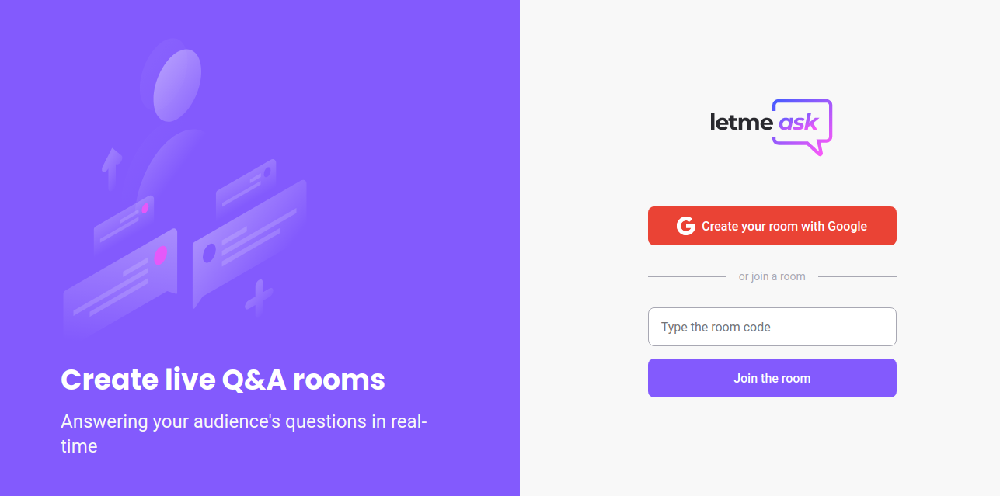
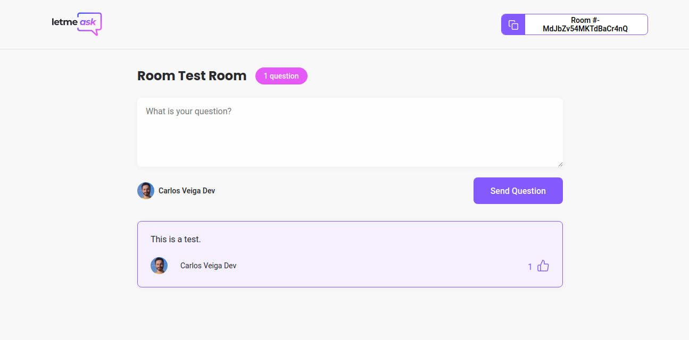
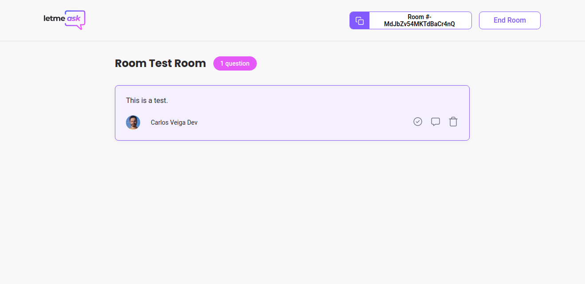

# **Let me Ask**

This is a project developed at NWL 6, where is learned react and firebase to develop a website for streamers to create rooms where you are able to answer your audience's questions in real-time.

The main objective of this project was to improve the use of TypeScript, React and Firebase. I also used custom hooks and added proper linters for the project.

## **Built With**
- React
- Google Authentication
- Firebase (Database and Deploy)

## **Examples**
You can access the project here:
[LetmeAsk](https://letmeask-6d92e.web.app/)
 

 

 

 

 
## **Getting Started**
 
Clone the repository by clicking on "Clone or Download" and copy the given link. In your terminal, go to the folder where you want the project to be and use the following command:
`git clone https://github.com/carlosveigadev/letmeask.git`
After that, open the folder with the code editor of your choice and follow the steps below.
## **Setting up the necessary packages:**
**Make sure you have [Yarn](https://yarnpkg.com/) installed in your machine.**
**Open the terminal and go to the folder of the game and run the following commands:**  
`yarn install`  
`yarn start`  

**Those commands will ensure you installed the proper packages required and start the server locally, usually at localhost:3000**

## **Author**
👤 **Carlos Veiga**
- [GitHub](https://github.com/carlosveigadev)
- [Twitter](https://twitter.com/carlosveigadev)
- [Linkedin](https://linkedin.com/carlosveigadev)
## 🤝 **Contributing**
Contributions, issues, and feature requests are welcome!
Feel free to check the [issues page](https://github.com/carlosveigadev/letmeask/issues).

## **Show your support**
Give a ⭐️ if you like this project!

## **Acknowledgments**
- NWL 6
## 📝 **License**
This project is [MIT](LICENSE) licensed.

